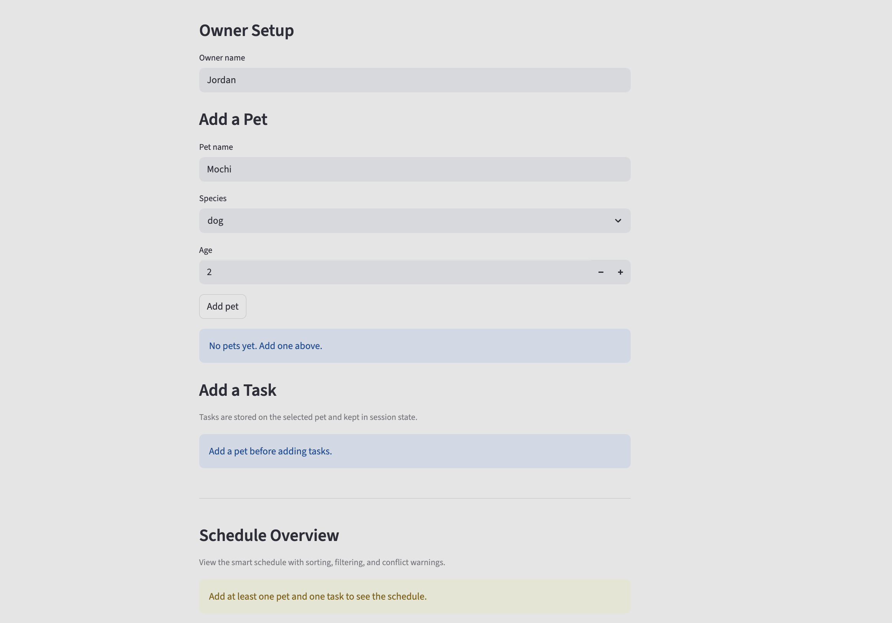

# PawPal+ (Module 2 Project)

You are building **PawPal+**, a Streamlit app that helps a pet owner plan care tasks for their pet.

## Scenario

A busy pet owner needs help staying consistent with pet care. They want an assistant that can:

- Track pet care tasks (walks, feeding, meds, enrichment, grooming, etc.)
- Consider constraints (time available, priority, owner preferences)
- Produce a daily plan and explain why it chose that plan

Your job is to design the system first (UML), then implement the logic in Python, then connect it to the Streamlit UI.

## What you will build

Your final app should:

- Let a user enter basic owner + pet info
- Let a user add/edit tasks (duration + priority at minimum)
- Generate a daily schedule/plan based on constraints and priorities
- Display the plan clearly (and ideally explain the reasoning)
- Include tests for the most important scheduling behaviors

## Features

- Add and manage multiple pets for one owner.
- Add pet-care tasks with times, recurrence, and completion tracking.
- View a schedule sorted by time using the scheduler logic layer.
- Filter tasks by pet and completion status in the Streamlit UI.
- Automatically create the next daily or weekly task occurrence when a recurring task is completed.
- Show lightweight scheduling conflict warnings when two tasks share the same date and time.
- Suggest the next available scheduling slot for a new task based on existing tasks for the day.

## 📸 Demo

Add a screenshot of your final Streamlit app here after you capture it.

<a href="demo.png" target="_blank"></a>

## Smarter Scheduling

PawPal+ now includes a few lightweight scheduling features that make the system more useful:

- Tasks can be sorted by time for a cleaner daily schedule.
- Tasks can be filtered by pet name or completion status.
- Daily and weekly recurring tasks automatically create the next occurrence when completed.
- The scheduler detects exact same-time conflicts and returns warning messages instead of crashing.
- The scheduler can suggest the next open time slot for a new task using fixed time increments.

## Agent Mode Extension

For the optional extension, Agent Mode was used as a step-by-step implementation partner:

- review the existing scheduler design and choose an extension that fit the current data model
- implement a `find_next_available_slot(...)` algorithm without disrupting the earlier features
- verify the change with an automated test and surface the result in the Streamlit UI

This made it easier to extend the project incrementally while keeping the architecture consistent.

## Testing PawPal+

Run the automated tests with:

```bash
./.venv/bin/python -m pytest
```

The current test suite verifies task completion, task addition, chronological sorting, daily recurrence, exact-time conflict detection, and next-available-slot suggestions.

Confidence Level: 4/5 stars based on the current passing test suite and manual CLI checks.

## Getting started

### Setup

```bash
python -m venv .venv
source .venv/bin/activate  # Windows: .venv\Scripts\activate
pip install -r requirements.txt
```

### Suggested workflow

1. Read the scenario carefully and identify requirements and edge cases.
2. Draft a UML diagram (classes, attributes, methods, relationships).
3. Convert UML into Python class stubs (no logic yet).
4. Implement scheduling logic in small increments.
5. Add tests to verify key behaviors.
6. Connect your logic to the Streamlit UI in `app.py`.
7. Refine UML so it matches what you actually built.
